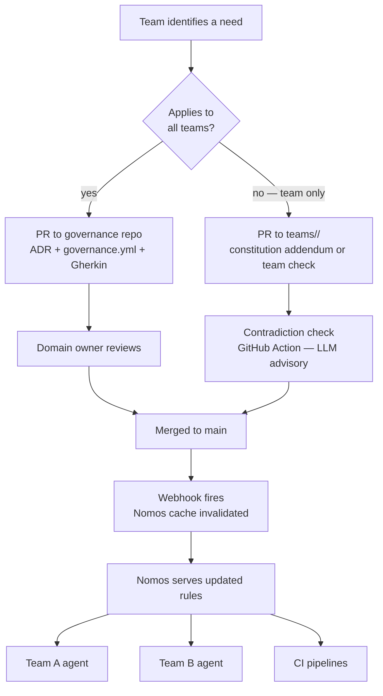
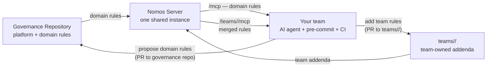

# Governance for product teams

This document is for engineers and team leads who use governed projects — not for the
platform team that operates the governance server.

→ For deployment setup: [DEPLOYMENT.md](DEPLOYMENT.md)
→ For the methodology behind this: [Constitutional Governance](https://github.com/your-org/constitutional-governance)

---

## What governance means for your team

The platform team has defined naming conventions, RBAC rules, and architectural decisions
in a governance repository. A Nomos server exposes those rules.

**Before Nomos:** your AI agent guesses at naming conventions, generates something that
violates a rule you didn't know existed, and a human catches it in code review — or nobody
does and it reaches production.

**After Nomos:** your agent queries the governance server before generating anything. It
knows the valid topic prefixes, the RBAC role names, the required segment count. It
produces valid output on the first attempt. The violation never happens.

You do not need to read the governance documentation. Your agent reads it for you.

---

## Discovering what rules apply to your domain

Once your project has a `.mcp.json` pointing at the shared server, your agent can
enumerate everything that is governed:

```
list_constitutions()
→ ["global", "kafka", "camel", "springboot"]

get_constitution("kafka")
→ The Kafka platform constitution — why naming consistency matters,
  what the non-negotiable invariants are

list_adrs()
→ [{id: "001", title: "Kafka topic naming", status: "Accepted"},
   {id: "002", title: "Consumer group naming", status: "Accepted"},
   ...]

get_checks("kafka")
→ [{title: "Topic naming convention", status: "enforced"},
   {title: "RBAC bindings", status: "enforced"},
   ...]
```

Ask your agent: *"What governance rules apply to my Kafka topics?"* It will query
the server and give you a structured answer based on current, live rules.

---

## The day-to-day workflow

### Creating a new resource

Without governance, your workflow is:
1. Guess a name based on what you've seen before
2. Submit a PR
3. Wait for review — reviewer may or may not know the convention
4. Fix if rejected, re-review

With governance, your workflow is:
1. Ask your agent to create the resource
2. The agent queries the governance server: failures catalog first, then conventions, then constitution
3. The agent generates the resource and self-validates via `validate_*` before returning
4. If validation fails, the agent revises using the specific errors as context and validates again — one retry cycle, not a loop
5. Submit a PR — the name is already correct
6. CI confirms with `@enforced` Gherkin scenarios

The review cycle for naming and configuration is eliminated. Reviewers focus on logic.

**What the retry looks like in practice:**
The agent generates `payments-svc`. Validation returns `{valid: false, errors: ["missing {capability} segment"]}`. The agent re-attempts with that error as context and produces `payments-checkout-svc`. Validates again — passes. The human never sees the failed attempt.

### Before starting any platform work

Ask your agent to orient you:

```
get_constitution("kafka")          — what are the non-negotiable rules?
get_kafka_conventions()            — what are the patterns?
list_adrs()                        — what decisions have been made?
get_active_rules()                 — what is the current governance.yml?
```

This is faster than reading documentation that may be stale.
The governance server is always current.

### Validating before committing

```bash
# Validate locally before pushing
nomos-validate --server https://governance.yourcompany.com topic your.topic.name.v1
nomos-validate --server https://governance.yourcompany.com sa sa-payments-connector-source-jdbc-prod
```

Exit code 0 = valid. Exit code 1 = errors with explanation.

If you have the pre-commit hook configured (see [DEPLOYMENT.md](DEPLOYMENT.md#part-3)),
this runs automatically on every commit.

---

## When rules change

Rule changes follow this flow:

```
Platform team merges an ADR change to the governance repo
        │
        ▼
GitHub webhook fires → Nomos invalidates its cache
        │
        ▼
Next request to the server returns the updated rules
        │
        ▼
Your agent, pre-commit hook, and CI pipeline all see the new rules immediately
```

You do not need to do anything. Your `.mcp.json` points at the server — not a version
of the rules. The server is always current.

**If a rule changes and your existing resources no longer comply:**
- The platform team is responsible for communicating breaking changes via ADR amendment
- The ADR will document what changed, why, and what the migration path is
- Query `get_adr("NNN")` for the amendment details

---

## Proposing a new rule or changing an existing one

Governance rules live in the governance repository as code. Proposing a change means
opening a pull request.

### When to propose

- You discover a pattern that is being violated inconsistently across teams
- You make an architectural decision that should apply to all teams in your domain
- An existing rule no longer matches how the platform actually works
- You need a rule for a domain that isn't governed yet

### How to propose

1. **Fork or branch the governance repository**

2. **If it's a new decision: write an ADR**

   ```markdown
   # ADR-NNN: Your Decision Title

   **Status:** Proposed
   **Date:** YYYY-MM-DD

   ## Decision
   What exactly are you deciding?

   ## Rationale
   Why? What constraint or requirement drives this?

   ## Alternatives rejected
   What else did you consider and why did you reject it?

   ## Consequences
   What gets easier? What gets harder?
   ```

3. **If it changes `governance.yml`: update the values**

   `governance.yml` drives validators. If your proposal changes what names are valid,
   update the relevant section.

4. **If it needs a new check: add a Gherkin scenario**

   Add it as `@wip` first. Once the platform team adds step definitions, it becomes
   `@enforced`.

5. **Open a pull request**

   The PR is the governance amendment. The description is the rationale.
   The platform team reviews, discusses, and merges — or requests changes.

### What happens after the PR is merged

The governance repo updates. The webhook fires. The Nomos server picks up the change.
Every agent and hook sees the new rule within seconds.

---

## The governance lifecycle

This is the full flow of a governance rule — from proposal to enforcement across all teams:



A rule change goes from proposal to enforcement in minutes. No redistribution.
No team needs to pull, restart, or reconfigure anything.

### The team's position in the model



Your team is both a **consumer** of governance (you get merged rules at your team endpoint)
and a **contributor** at two levels: domain rules via PR to the platform team, and
team-specific rules via PR to your own `teams/<name>/` directory.

---

## Synergies: what each role gets

### Individual engineer

- **No more name rejections in review.** The agent validates before generating.
  You stop spending review cycles on naming conventions.
- **No more "what's the convention?" questions.** Ask your agent. It knows.
- **Faster onboarding.** A new engineer connects their agent and immediately has
  access to all conventions, decisions, and rationale — without reading stale wikis.

### Team lead

- **Consistent output across the team.** Every engineer and every agent produces
  names and configurations that meet the same standard.
- **Governance changes propagate automatically.** Update the governance repo once.
  Every team member's agent sees the change on their next query — no re-training,
  no updated docs, no broadcast email.
- **Architectural decisions have a paper trail.** ADRs record what was decided and why.
  When someone asks "why is this named this way?", the answer is in the governance server.

### Platform team

- **One place to update rules.** Change a prefix list or a role name once.
  Every team that queries the server gets the update. No copy-paste drift.
- **Compliance is automatic, not manual.** `@enforced` Gherkin runs in every PR.
  Violations are caught before they reach the platform — not in an incident review.
- **Governance contribution is a normal PR.** Teams propose rules via pull request.
  The amendment history is in git. Nothing is tribal knowledge.

---

## Onboarding a new engineer

When a new engineer joins a team:

1. They clone the project — `.mcp.json` is already there
2. They connect Claude Code (or any MCP-compatible agent) — governance is automatically available
3. Before they write their first topic name, they can ask: *"What are the Kafka naming conventions?"*
4. Their agent queries the governance server and gives them the current, authoritative answer

No wiki to read. No onboarding doc to keep up to date. No senior engineer needed to explain "the way we do things here."

The governance server is the institutional memory.

---

## Questions the governance server can answer

These are real queries your agent can make at any time:

| Question | Tool |
|---|---|
| What domains are governed? | `list_constitutions()` |
| What are the Kafka platform principles? | `get_constitution("kafka")` |
| What naming conventions exist? | `get_kafka_conventions()` |
| Is this topic name valid? | `validate_topic_name("raw.payments.pos.team.receipts.tx.v1")` |
| Is this RBAC binding valid? | `validate_rbac_binding("DeveloperManage", "cluster", "kafka-cluster")` |
| Why does this rule exist? | `get_adr("001")` |
| What architectural decisions have been made? | `list_adrs()` |
| What checks will CI run on my PR? | `get_checks("kafka")` |
| What are the current validation rules? | `get_active_rules()` |

---

## If the governance server is unreachable

Nomos fails closed by default. If the server is unreachable when your agent tries to query it, the agent workflow will stop rather than proceed without governance context.

This is intentional. An agent generating resources without querying the spec is not a governed agent — it's back to the same situation as before governance was in place.

If you see connection errors in your agent or pre-commit hook, check with your platform team — the server may be down or your `.mcp.json` may be pointing at the wrong endpoint. For production CI, a governance server unavailability will fail the check the same way a test failure would.
